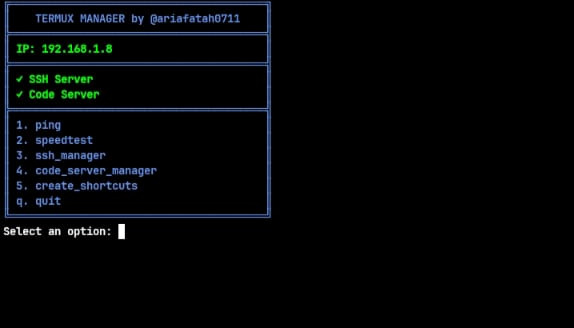
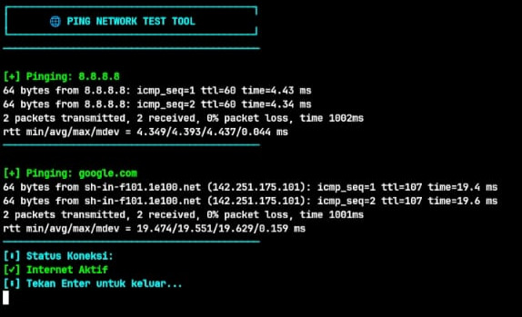
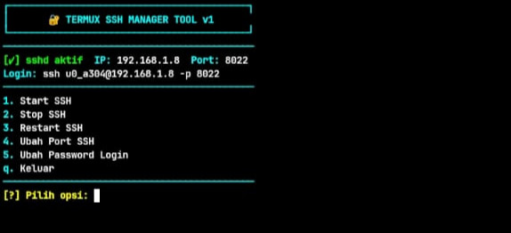
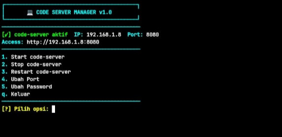

# termux-manager

## setup
```bash
git clone https://github.com/ariafatah0711/termux_manager
chmod +x setup.sh
./setup.sh
```

## use
```bash
termux-manager
```

## list script
- ```main.sh``` \
  

- ```script/ping``` \
  

- ```script/speedtest``` \
  

- ```script/ssh-manager``` \


- ```script/code_server-manager``` \
  

## information
### push repo with token
- go to https://github.com/settings/personal-access-tokens/new
- and add the repo your want to token and add the permission repo **content**
```bash
git remote add origin https://<token>@github.com/username/myrepo.git
```